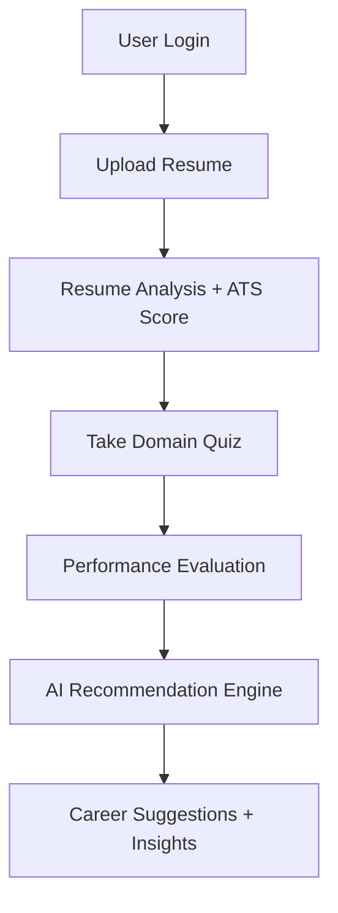

# 🚀 Career Intelligence

### AI-Powered Career Recommendation Platform

<p align="center">
  <b>Analyze. Evaluate. Recommend. Transform Careers with AI.</b>
</p>

---

## 🌐 Overview

**Career Intelligence** is a next-generation AI-driven platform designed to help users discover the most suitable career paths through **resume intelligence, behavioral analysis, and conversational AI**.

The system combines **ATS-based resume evaluation**, a **multi-stage domain-specific quiz engine**, and an **interactive AI chatbot** to deliver **personalized, data-driven career recommendations**.

---

## ✨ Core Capabilities

### 🤖 Intelligent Chatbot System

* Real-time conversational AI for career guidance
* Context-aware responses based on user interaction
* Enhances engagement and decision-making

---

### 📄 Resume Intelligence Engine

* Upload resumes for deep AI analysis
* Extracts:

  * Skills & keywords
  * Experience insights
  * Resume structure evaluation
* Generates:

  * ✅ ATS Score
  * ✅ Detailed improvement suggestions
  * ✅ Keyword optimization insights

---

### 🧠 Multi-Stage Career Assessment Engine

* 15+ career domains
* 30 MCQs per domain
* 5 progressive evaluation stages
* Outputs:

  * 📊 Score analysis
  * 📈 Performance breakdown
  * 🎯 Recommended career paths

---

### 🌐 Modern Frontend Architecture

Built using **React.js** with a scalable component-based structure:

* Home
* About
* Contact
* Career Analysis
* AI Chat Interface
* Authentication (Login)
* Quiz Engine

---

### 💾 Data Handling

* Lightweight storage using Local Storage
* Maintains:

  * User session data
  * Quiz performance
  * Resume reports

---

## 🏗️ System Architecture

```bash
career-intelligence/
│
├── backend/        # APIs, AI processing, business logic
├── frontend/       # React application (UI/UX)
├── README.md
├── package.json
└── vite.config.js
```

---

## ⚙️ Tech Stack

| Layer    | Technology                   |
| -------- | ---------------------------- |
| Frontend | React.js, HTML, CSS          |
| Backend  | Node.js / Python             |
| AI/NLP   | Resume Parsing, Chatbot APIs |
| Storage  | Local Storage                |

---

## 🔄 Application Workflow



---

## 🚀 Getting Started

### 1️⃣ Clone Repository

```bash
git clone https://github.com/YOUR_USERNAME/career-intelligence.git
cd career-intelligence
```

---

### 2️⃣ Setup Frontend

```bash
cd frontend
npm install
npm run dev
```

---

### 3️⃣ Setup Backend

```bash
cd backend
npm install
npm start
```

---

## 📊 Key Highlights

* 🔥 AI-powered career recommendation system
* 🧠 Multi-layer evaluation (Resume + Quiz + Chatbot)
* 📄 ATS-based resume scoring engine
* 🎯 Personalized career insights
* ⚡ Full-stack scalable architecture

---

## 🧩 Problem Statement

Students often lack clarity about:

* Which career domain suits them
* Whether their resume meets industry standards
* How to improve skills for specific roles

---

## 💡 Solution

Career Intelligence solves this by:

* Evaluating both **skills (resume)** and **interests (quiz)**
* Providing **data-driven recommendations**
* Offering **real-time AI assistance**

---

## 🚀 Future Roadmap

* 🔐 User authentication with database (MongoDB)
* 🧠 Machine Learning recommendation model
* ☁️ Cloud deployment (AWS / Vercel)
* 📊 Analytics dashboard
* 📱 Mobile-responsive advanced UI

---

## 👨‍💻 Author

**Bhagavan**
B.Tech – Artificial Intelligence & Data Science

---

## ⭐ Show Your Support

If you found this project useful:
⭐ Star this repository
🔁 Share with others

---

## 📬 Contact

Feel free to connect for collaboration or opportunities!
The project ui interfaces you can check it here


